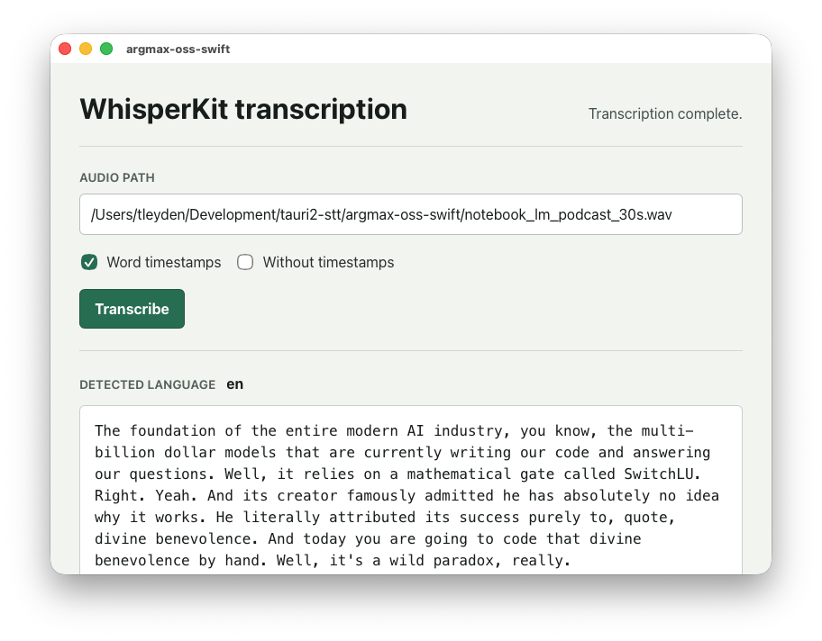

<p align="center">
  <a href="https://deepwiki.com/tleyden/tauri2-stt"></a>
</p>

<p align="center">
  <a href="./AppScreenshot.png"></a>
</p>

This is a prototyping repo to get a solid local transcription library running from a Tauri2 desktop app, since I am planning to integrate this into the language learning app I'm building: [Fluensy](https://fluensy.app)

Right now I mainly need it on macOS, so there is a heavy bias towards that platform. 

## P0 Requirements

1. Doesn't require GPU, but will use it if available
2. Runs on macOS
3. Fast
4. Relatively low resource requirements
5. Callable from Tauri2 via FFI (not sidecar)
6. Accurate timestamps in transcripts
7. Streaming transcriptions
8. Allow for commercial use


## How to run it

The Tauri 2 app is in [`argmax-oss-swift`](./argmax-oss-swift).

```sh
cd argmax-oss-swift
bun install
bun run tauri dev
```


## Design notes - best integration strategy?

### Option 1: WhisperKit (implemented)

#### Strengths

1. Supports all requirements

#### Risks

1. Async API, needs to be wrapped in sync wrappers on the swift side
